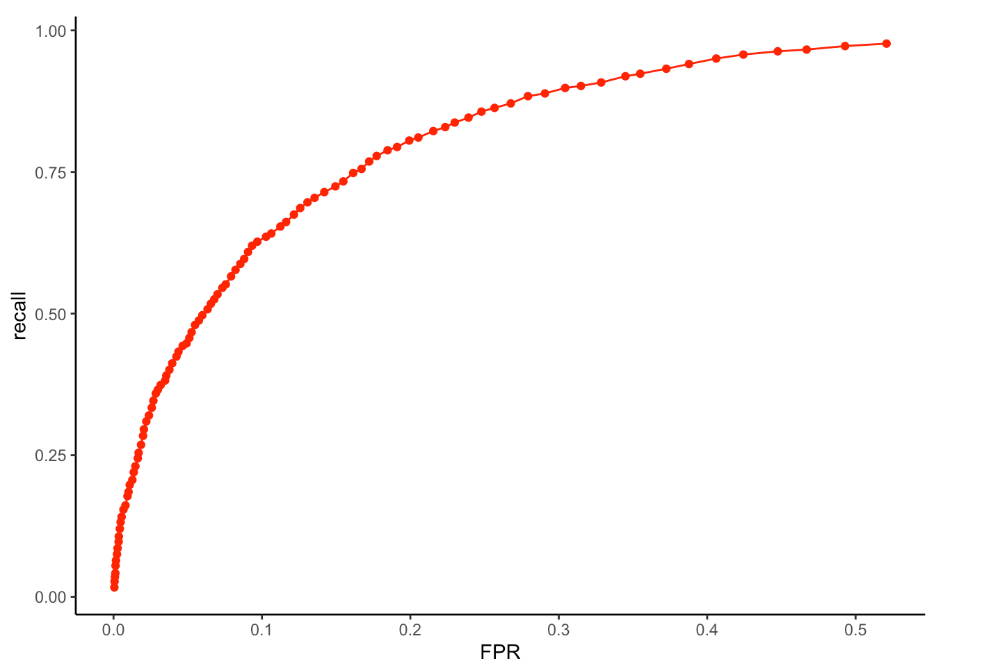
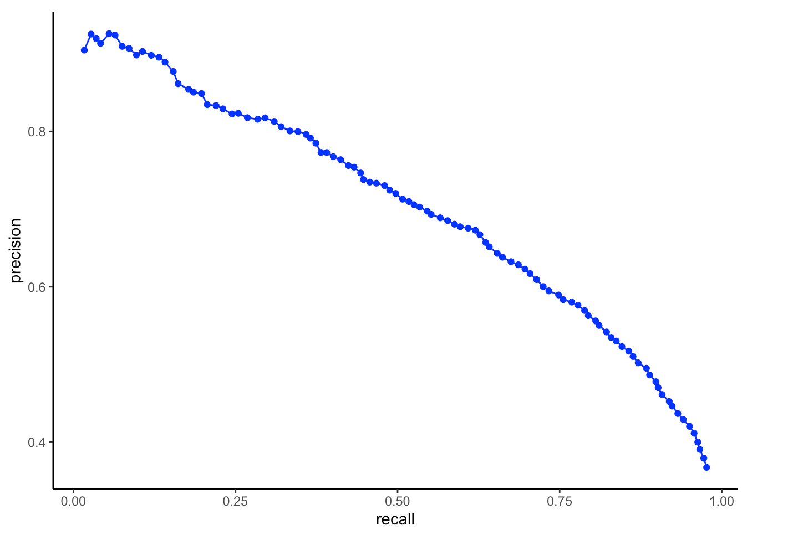

# README

## **m6APrediction**

### **1.Introduction**

m6APrediction is an R package for predicting m6A RNA modification sites
using a trained random forest model.

The package provides:

-   **dna_encoding()**: Encodes 5-mer DNA sequences (e.g. “ATCGA”) into
    position-wise nucleotide features (nt_pos1–nt_pos5) for model input.

-   **prediction_multiple()**: Uses a fitted random forest model to
    predict m6A modification probabilities and statuses for multiple
    candidate sites based on sequence context and related features.

-   **prediction_single():** A convenient wrapper that predicts m6A
    probability and classification for one candidate site, internally
    calling prediction_multiple().

This tool is intended to help researchers rapidly evaluate potential m6A
sites in RNA using consistent feature engineering and a trained model.

### **2.Installation**

You can install the development version of m6APrediction from GitHub.

**Using devtools：**

``` r
# install.packages("devtools") # if not installed 
devtools::install_github("xinyu20050315-dot/m6APrediction")
```

**Using remotes：**

``` r
# install.packages("remotes") # if not installed 
remotes::install_github("xinyu20050315-dot/m6APrediction")
```

After installation:

``` r
library(m6APrediction)
```

### **3.Minimal Examples**

Below are minimal examples demonstrating how to use the two prediction
functions prediction_multiple() and prediction_single(), based on actual
function definitions.

#### **#3.1 Example: Multiple-site prediction (prediction_multiple)**

This example assumes: A trained random forest model is stored as
extdata/rf_fit.rds.

An example input feature table is stored as
extdata/m6A_input_example.csv.

``` r
library(m6APrediction)

#Load trained random forest model
ml_fit <- readRDS( system.file("extdata", "rf_fit.rds", package = "m6APrediction") )

#Load example input features
feature_df <- read.csv( system.file("extdata", "m6A_input_example.csv", package = "m6APrediction") )

#Run multiple-site prediction
result_multiple <- prediction_multiple( ml_fit, feature_df, positive_threshold = 0.5 )

head(result_multiple) 
```

If you construct the feature table manually, it must include at least:

gc_content RNA_type (“mRNA”, “lincRNA”, “lncRNA”, “pseudogene”)

RNA_region (“CDS”, “intron”, “3’UTR”, “5’UTR”)

exon_length

distance_to_junction

evolutionary_conservation

DNA_5mer (a 5-mer like “ATGCA”)

prediction_multiple() will:

Encode DNA_5mer into nt_pos1–nt_pos5 using dna_encoding().

Call predict() on the random forest model to obtain “Positive” class
probabilities.

Add: predicted_m6A_prob predicted_m6A_status (“Positive” / “Negative”)

#### #3.2 Example: Single-site prediction (prediction_single)

prediction_single() is a user-friendly wrapper for one candidate site.

``` r
library(m6APrediction)

#Load trained model
ml_fit <- readRDS( system.file("extdata", "rf_fit.rds", package = "m6APrediction") )

#Predict for one candidate site
result_single <- prediction_single( ml_fit = ml_fit, gc_content = 0.6, RNA_type = "mRNA", RNA_region = "CDS", exon_length = 1500, distance_to_junction= 120, evolutionary_conservation = 0.8, DNA_5mer = "ATGCA", positive_threshold = 0.5 )

result_single
```

The output is a named vector: predicted_m6A_prob predicted_m6A_status

### **4.Model Performance (ROC and PRC Curves)**

##### **To d**emonstrate the strong predictive power of the random forest model, the following figures show the ROC and PRC curves generated in Practical 4.

To demonstrate the strong predictive power of the model:





These plots highlight the model’s accuracy and precision, serving as an
effective visual showcase for your GitHub page.
